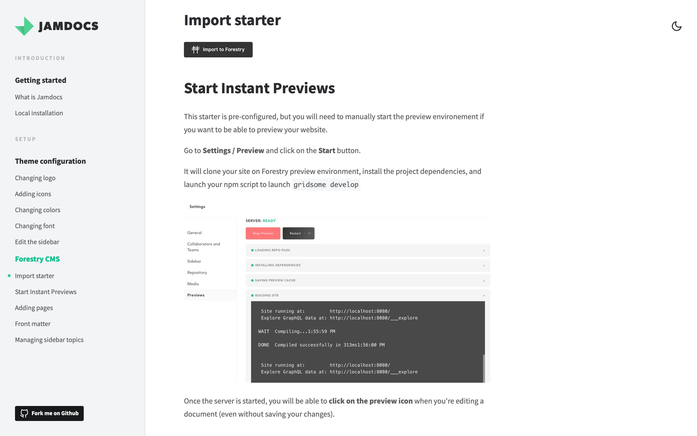

# 

https://vacinacaocovid.com.br

Este projeto tem o intuito de informar através de perguntas e respostas as questões sobre a vacinação da Covid, com as dúvidas mais recorrentes da população.

Se você gostaria de ver aqui algum conteúdo e tem alguma sugestão, você pode [iniciar uma discussão aqui](https://github.com/alexanmtz/informativo-vacina-covid-19/discussions).

_Este projeto foi construído com o Jamdocs: https://github.com/samuelhorn/jamdocs._

## Propósito

Com o intuito de combater as fakenews, fiz este informativo para esclarecer melhor todas dúvidas em relação a vacinação contra o COVID-19

## Especificações do projeto

O projeto foi desenvolvido com o Vuex, usando um CMS headless, que não possui banco de dados e é publicado gratuitamente no Github com uma Action de deploy dos estáticos no Githubpages.

## Como rodar o projeto localmente

1. `git clone https://github.com/alexanmtz/informativo-vacina-covid-19.git`.
2. `cd informativo-vacina-covid-19`
3. `yarn`
4. `gridsome develop`.

## Textos editados no Forestry.io

Este projeto foi configurado para o [Forestry](https://forestry.io). As mudanças feitas no Forestry são enviadas diretamente para o repositório e publicado no site. ✨

Veja a documentação do Forestry usando o Jamdocs:

## Suporte

Você pode ajudar com este projeto para pagarmos pelo desenvolvimento e manutenção, bem como melhorias.

Basta acessar o nosso Open Collective: https://opencollective.com/informativo-vacina-covid

## Créditos

* Créditos para o time do [Gridsome](https://gridsome.org/) para criar esta solução para construir websites estáticos.
* Créditos para [Evan You](https://twitter.com/youyuxi) por ter criado o [Vue](https://vuejs.org/).
* Créditos para o [Forestry](https://forestry.io/) para criar uma solução amigável para edição de conteúdo Markdown e integrar ao Github.

## License

[Apache](https://github.com/alexanmtz/informativo-vacina-covid-19/blob/main/LICENSE)

## Contribuição

Se desejar contribuir, achar algum erro, você pode enviar um pull request. E se deseja ajudar na tradução dos artigos que compõe este site, entre em contato comigo através do meu email: alexanmtz@gmail.com
